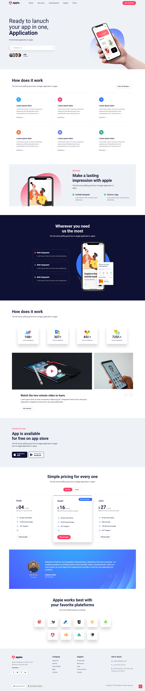
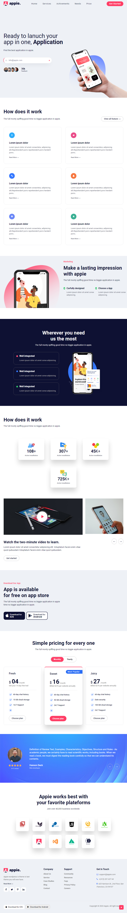
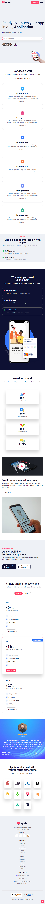

# Html & Css Template

I did this simple project to practice using CSS and HTML in best practices to get web projects off on the right foot.

<h3>
  <a href="https://template-gilt-seven.vercel.app/" target="_blank"  title="Demo">
    Live Demo
  </a>
</h3>

### Made with :heart: 
